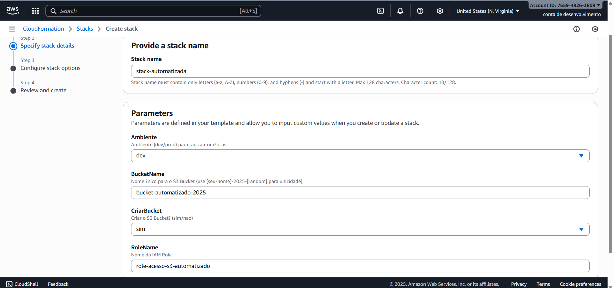
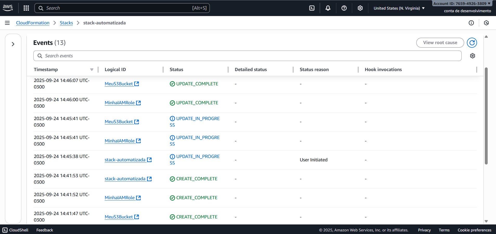
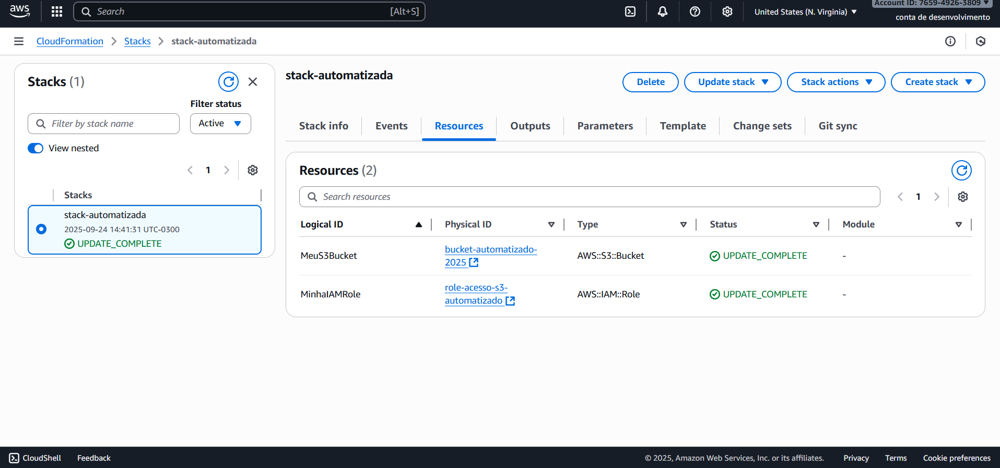
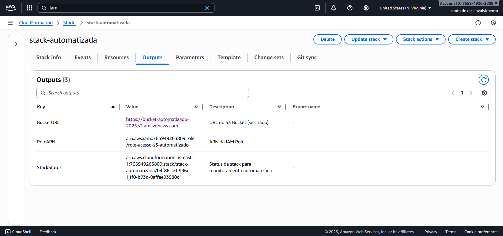

  

# Desafio AWS CloudFormation - Bootcamp Santander Code Girls 2025

Olá! Bem-vindo(a) ao meu repositório do desafio prático de **AWS CloudFormation** do Bootcamp Santander Code Girls 2025. Neste projeto completo, implementei **Infrastructure as Code (IaC)** para provisionar recursos AWS de forma automatizada, idempotente e declarativa. Comecei com uma stack básica (S3 Bucket privado + IAM Role) e evolui para uma versão avançada com condições, parâmetros dinâmicos e tags automáticas – demonstrando progressão de conceitos das aulas.

O foco é aplicar templates YAML, monitoramento de stacks e boas práticas de IaC. Tudo testado na região **us-east-1** (N. Virginia) com AWS. #CodeGirls2025 #WomenInTech

## Por Que CloudFormation?
- **IaC:** Define infraestrutura em código (YAML/JSON), facilitando versionamento no GitHub e deploys repetíveis.
- **Benefícios:** Automatiza criação/atualização/deleção de recursos (ex.: S3 + IAM), reduz erros manuais e integra com CI/CD.
- **Meu Caso:** Stack básica para armazenamento seguro (S3 com role IAM); evolução para cenários reais (condições para dev/prod no Santander).

## Pré-requisitos
- Conta AWS gratuita (Free Tier): Crie em [aws.amazon.com](https://aws.amazon.com/free/) se não tiver.
- Console AWS: Acesse via [console.aws.amazon.com](https://console.aws.amazon.com/) (use root user para simplicidade).
- Editor de texto: Bloco de Notas ou VS Code para editar o YAML.
- GitHub: Repo criado para versionar templates e imagens.
- Região: Use **us-east-1** para compatibilidade.

**Aviso:** Monitore custos no Free Tier (S3 e IAM são gratuitos para volumes baixos). Delete stacks após testes!

## Projeto 1: Stack Básica (minha-primeira-stack.yaml)
O template inicial define 2 recursos principais:
- **S3 Bucket:** Privado, com nome parametrizado (único globalmente).
- **IAM Role:** AssumeRole para acesso ao S3, com policy inline.

Veja o arquivo `minha-primeira-stack.yaml` na raiz do repositório para o código completo. Ele usa parâmetros para customização, funções como `!Ref` e `!Sub`, e outputs para expor resultados.

- **Explicação Rápida:**
  - **Parameters:** Permite customizar nomes sem editar o YAML (ex.: BucketName único).
  - **Resources:** Define o S3 (privado) e IAM Role (com policy para Get/Put no bucket).
  - **Outputs:** Expõe URL do bucket e ARN da role para uso em outras stacks.
  - **Validação:** Use "Create stack" > Upload template para testar sintaxe (mensagem "Template válido").

## Prática Hands-On: Criando a Stack Básica
Siga esses passos no Console AWS para deploy (eu capturei telas de cada etapa):

1. **Prepare o Template:**
   - No Console CloudFormation > "Create stack" > "With new resources" > "Upload a template file".
   - Selecione `minha-primeira-stack.yaml` > Valide (deve mostrar "Template válido").

2. **Especifique Detalhes:**
   - Nome da stack: `minha-primeira-stack-bootcamp`.
   - Parâmetros: BucketName (ex.: `bucket-seunome-2025-unico123`), RoleName (default).
   - Adicione tag: `Projeto: BootcampSantander2025`.

3. **Opções e Revisar:**
   - Deixe padrão (role IAM automática).
   - Revise: Confirme 2 recursos (S3 e IAM).
   - Clique "Create stack" > Monitore até "CREATE_COMPLETE" (~2-5 min).

4. **Teste:**
   - Vá para S3 Console > Buckets > Upload arquivo no seu bucket.
   - Verifique Outputs para URL/ARN.

5. **Limpeza:** Delete a stack para remover recursos (veja seção abaixo).

## Capturas de Tela: Stack Básica
Documentei o processo com screenshots reais do meu deploy inicial.

### Processo de Criação

*Upload do template YAML e configuração de parâmetros (nome da pilha e BucketName único).*

### Stack Completa e Recursos

*Status CREATE_COMPLETE na lista de stacks.*

*S3 Bucket e IAM Role provisionados.*

**Logs de Criação (Eventos da Stack):**

*Histórico de eventos: Início da stack, criação do S3 Bucket e IAM Role, final com CREATE_COMPLETE.*

### Outputs e Teste no S3

*BucketURL e RoleARN expostos para integração futura.*

*Upload bem-sucedido de arquivo teste no bucket criado, validando funcionalidade.*

## Evolução: Projeto 2 - Infraestrutura Automatizada
Para o desafio avançado, evolui a stack básica para uma versão mais robusta na pasta dedicada [`projeto-automatizado/`](projeto-automatizado/). Adicionei **condições** (ex.: criar S3 só se parâmetro "sim"), **tags automáticas** (dinâmicas via !Ref para dev/prod) e **policies gerenciadas** para segurança. Isso demonstra idempotência em updates e reutilização em pipelines CI/CD.

- **Template Principal:** [`stack-automatizada-corrigida.yaml`](projeto-automatizado/stack-automatizada-corrigida.yaml) – YAML validado com arrays em policies e AllowedValues.
- **Conceitos Aplicados:** Conditions (!Equals), tags para governança, outputs condicionais. Testei updates (ex.: mudar Ambiente sem recriar tudo).
- **Por Quê Evoluir?** Simula cenários reais: Flexibilidade para ambientes (dev/prod) e redução de recursos desnecessários.

Veja a documentação completa:
- [`README-automatizado.md`](projeto-automatizado/README-automatizado.md): Passos detalhados e pré-requisitos.
- [`insights-automatizados.md`](projeto-automatizado/insights-automatizados.md): Reflexões pessoais (ex.: como automação reduz bias em setups manuais).

### Capturas de Tela: Stack Automatizada

*Configuração de condições (CriarBucket: sim) e tags dinâmicas.*

*Logs de CREATE e UPDATE (idempotência em tags).*

*Lista de recursos com tags automáticas (Projeto e Ambiente).*

*Outputs condicionais + upload no bucket para validação.*

## Insights e Desafios Enfrentados (Ambos os Projetos)
- **Aprendizado Principal:** Do básico (S3 + IAM simples) à automação (condições e tags), CloudFormation escala IaC para produção. Funções como !Ref e !Sub adicionam dinamismo; outputs facilitam chaining de stacks.
- **Desafios:**
  - **Básico:** BucketName único (erro "AlreadyExists") – Solução: Timestamps personalizados.
  - **Automatizado:** "Template format error" (parser em policies) – Solução: Arrays com `-` em Action/Principal; validei via Create stack.
  - **Geral:** Indentação YAML (2 espaços); monitoramento via Events para debugar (IN_PROGRESS → COMPLETE). Designer descontinuado – adaptei para validação nativa.
  - **Tempo:** Básico: 3 min; Automatizado: 5 min + update para idempotência.
- **Melhorias Futuras:** Nested stacks, integração com Lambda/CDK e GitHub Actions. Como Code Girl, vi como automação empodera: Reduz bias em setups manuais, focando em criatividade.
- **Custos:** Zero – Usei Billing Dashboard para trackear.

## Limpeza e Boas Práticas
- **Delete a Stack:** CloudFormation > Stacks > Selecione > "Delete" > Confirme. Remove tudo automaticamente (1-2 min).
- **Verifique:** S3 e IAM vazios pós-deleção.
- **Dicas:** Nomes únicos, tags para organização, change sets para previews. Para Free Tier, delete sempre! Use versionamento Git para templates.

## Referências
- Docs AWS: [CloudFormation User Guide](https://docs.aws.amazon.com/AWSCloudFormation/latest/UserGuide/Welcome.html) | [Condições em Templates](https://docs.aws.amazon.com/AWSCloudFormation/latest/UserGuide/conditions-section-structure.html).
- Aulas Bootcamp: IaC, YAML, ciclo de vida de stacks e automação avançada.
- Validador: Validação via "Create stack" no Console (Designer descontinuado em 2023).
- Ferramentas: [YAML Lint](https://www.yamllint.com/) para sintaxe; Repo GitHub para versionamento.

## Entrega do Desafio
- **Link do Repo:** [Desafio AWS CloudFormation Santander Code Girls 2025](https://github.com/AnnyKaah/desafio-aws-cloudformation-bootcamp-codegirls-2025.git)
- **Status:** Completo! Do básico (stack simples) à automatizado (condições/tags), com templates, docs e screenshots reais. Pronto para CLF-C02!

## 📌 Contato
Quer trocar ideias ou tirar dúvidas?  
- **LinkedIn:** [Anny Karoline](https://www.linkedin.com/in/annykarolinedecarvalhomartins/)  
- **Email:** annykamartins@icloud.com

**Atualizado em**: 24/09/2024. 

---

> Obrigada por conferir meu projeto! 🙌

