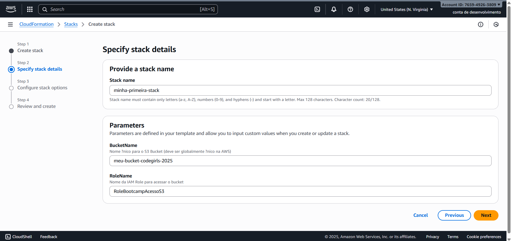
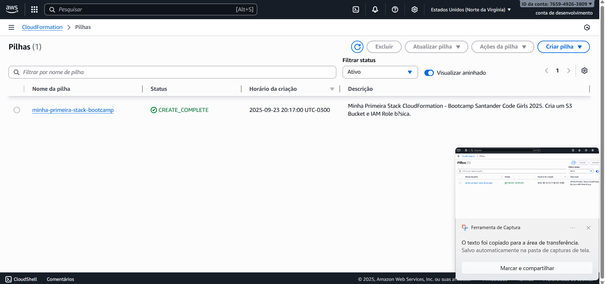
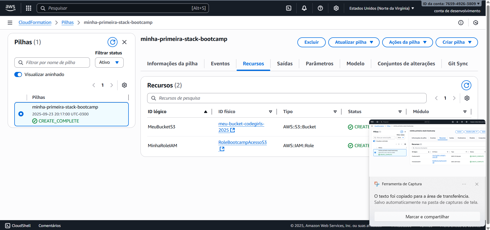
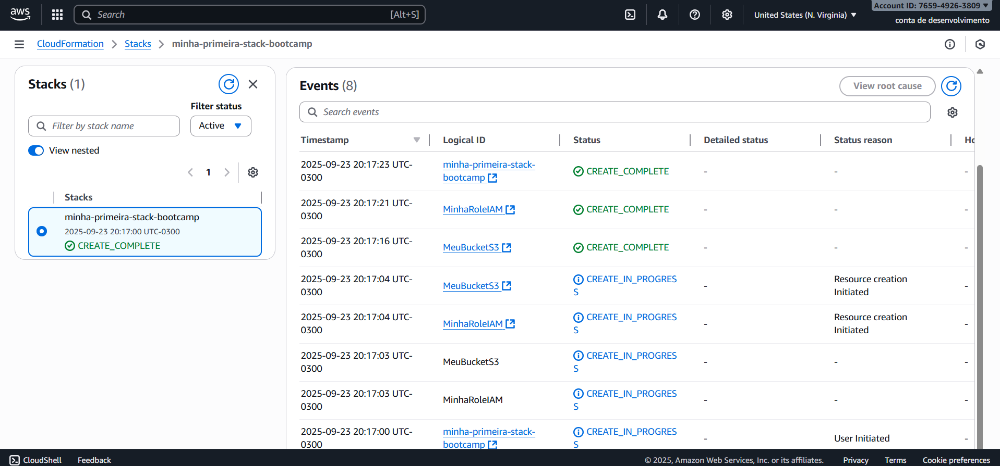
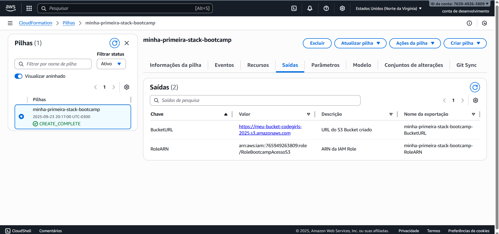
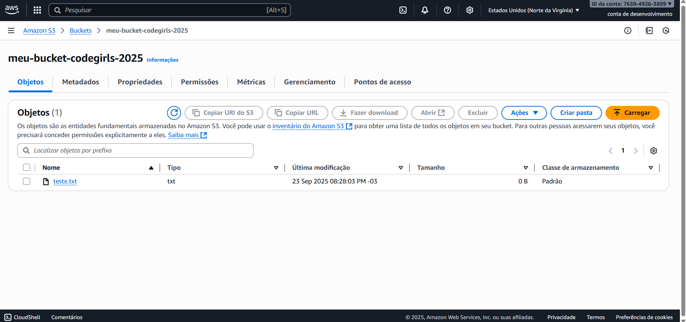

  

# Desafio AWS CloudFormation - Bootcamp Santander Code Girls 2025

Olá! Bem-vindo(a) ao meu repositório do desafio prático de **AWS CloudFormation** do Bootcamp Santander Code Girls 2025. Neste projeto, implementei **Infrastructure as Code (IaC)** para provisionar recursos AWS de forma automatizada, idempotente e declarativa. Criei uma stack simples que inclui um **S3 Bucket privado** e uma **IAM Role** com permissões de acesso ao S3, usando um template YAML customizado.

O foco é demonstrar os conceitos das aulas: templates YAML, parâmetros, recursos (Resources), outputs e monitoramento de stacks. Tudo foi testado na região **us-east-1** (N. Virginia) com a conta AWS Free Tier – zero custos!

## Por Que CloudFormation?
- **IaC:** Define infraestrutura em código (YAML/JSON), facilitando versionamento no GitHub e deploys repetíveis.
- **Benefícios:** Automatiza criação/atualização/deleção de recursos (ex.: S3 + IAM), reduz erros manuais e integra com CI/CD.
- **Meu Caso:** Criei uma stack para um cenário básico de armazenamento seguro (S3) com role IAM para acesso controlado – útil para apps web ou dados no Santander.

## Pré-requisitos
- Conta AWS gratuita (Free Tier): Crie em [aws.amazon.com](https://aws.amazon.com/free/) se não tiver.
- Console AWS: Acesse via [console.aws.amazon.com](https://console.aws.amazon.com/) (use root user para simplicidade).
- Editor de texto: Bloco de Notas ou VS Code para editar o YAML.
- GitHub: Repo criado para versionar o template e imagens.
- Região: Use **us-east-1** para compatibilidade.

**Aviso:** Monitore custos no Free Tier (S3 e IAM são gratuitos para volumes baixos). Delete stacks após testes!

## Template YAML: minha-primeira-stack.yaml
O template define 2 recursos principais:
- **S3 Bucket:** Privado, com nome parametrizado (único globalmente).
- **IAM Role:** AssumeRole para acesso ao S3, com policy inline.

Veja o arquivo `minha-primeira-stack.yaml` neste repositório para o código completo. Ele usa parâmetros para customização, funções como `!Ref` e `!Sub`, e outputs para expor resultados.

- **Explicação Rápida:**
  - **Parameters:** Permite customizar nomes sem editar o YAML (ex.: BucketName único).
  - **Resources:** Define o S3 (privado) e IAM Role (com policy para Get/Put no bucket).
  - **Outputs:** Expõe URL do bucket e ARN da role para uso em outras stacks.
  - **Validação:** Use o [Designer CloudFormation](https://console.aws.amazon.com/cloudformation/designer/home) para testar sintaxe.

## Prática Hands-On: Criando a Stack
Siga esses passos no Console AWS para deploy (eu capturei telas de cada etapa):

1. **Prepare o Template:**
   - No Console CloudFormation > "Criar stack" > "Com um template novo" > "Upload a template file".
   - Selecione `minha-primeira-stack.yaml` > Valide (deve mostrar "Template válido").

2. **Especifique Detalhes:**
   - Nome da stack: `minha-primeira-stack-bootcamp`.
   - Parâmetros: BucketName (ex.: `bucket-seunome-2025-unico123`), RoleName (default).
   - Adicione tag: `Projeto: BootcampSantander2025`.

3. **Opções e Revisar:**
   - Deixe padrão (role IAM automática).
   - Revise: Confirme 2 recursos (S3 e IAM).
   - Clique "Criar pilha" > Monitore até "CREATE_COMPLETE" (~2-5 min).

4. **Teste:**
   - Vá para S3 Console > Buckets > Upload arquivo no seu bucket.
   - Verifique Outputs para URL/ARN.

5. **Limpeza:** Delete a stack para remover recursos (veja seção abaixo).

## Capturas de Tela
Documentei o processo com screenshots reais do meu deploy.

### Processo de Criação

*Upload do template YAML e configuração de parâmetros (nome da pilha e BucketName único).*

### Stack Completa e Recursos

*Status CREATE_COMPLETE na lista de stacks.*

*S3 Bucket e IAM Role provisionados.*

**Logs de Criação (Eventos da Stack):**
Aqui, os logs detalhados mostram o fluxo de eventos durante o deploy, confirmando sucessos em cada recurso (sem erros no meu caso).

*Histórico de eventos: Início da stack, criação do S3 Bucket e IAM Role, final com CREATE_COMPLETE.*

### Outputs e Teste no S3

*BucketURL e RoleARN expostos para integração futura.*

*Upload bem-sucedido de arquivo teste no bucket criado, validando funcionalidade.*

## Insights e Desafios Enfrentados
- **Aprendizado Principal:** CloudFormation é poderoso para IaC – o YAML é legível e usa funções como `!Ref` e `!Sub` para dinamismo. Outputs facilitam reutilização (ex.: exportar para outra stack).
- **Desafios:**
  - **BucketName Único:** Erro "BucketAlreadyExists" – Solução: Adicionei timestamp/nome pessoal (ex.: `-2025-seunome123`).
  - **URL S3 Temporária:** AccessDenied normal (privada); ignorei e foquei no deploy.
  - **Validação YAML:** Indentação com espaços (não tabs) evitou erros de sintaxe.
  - **Tempo:** Deploy em 3 min; monitoramento via Events ajudou a entender o ciclo (IN_PROGRESS → COMPLETE).
- **Melhorias Futuras:** Adicionar VPC, EC2 ou condições (if/else) para stacks mais complexas. Integração com GitHub Actions para CI/CD.
- **Custos:** Zero – Monitorei via Billing Dashboard.

## Limpeza e Boas Práticas
- **Delete a Stack:** CloudFormation > Stacks > Selecione > "Excluir" > Confirme. Remove S3 e IAM automaticamente (1-2 min).
- **Verifique:** S3 Console (bucket sumiu) e IAM Console (role deletada).
- **Dicas:** Sempre use nomes únicos, tags para organização, e delete após testes para Free Tier limpo. Para produção, use stacks aninhadas (nested) e change sets para previews.

## Referências
- Docs AWS: [CloudFormation User Guide](https://docs.aws.amazon.com/AWSCloudFormation/latest/UserGuide/Welcome.html)
- Aulas Bootcamp: Conceitos de IaC, YAML e ciclo de vida de stacks.
- Validador: [CloudFormation Designer](https://console.aws.amazon.com/cloudformation/designer/home).
- Repo GitHub: Este projeto é versionado aqui – fork ou clone para praticar!

## Entrega do Desafio
- **Link do Repo:** [Desafio AWS CloudFormation Santander Code Girls 2025](https://github.com/AnnyKaah/desafio-aws-cloudformation-bootcamp-codegirls-2025.git)
- **Status:** Completo! Template funcional, stack criada/testada/deletada, com documentação visual.

## 📌 Contato
Quer trocar ideias ou tirar dúvidas?  
- **LinkedIn:** [Anny Karoline](https://www.linkedin.com/in/annykarolinedecarvalhomartins/)  
- **Email:** annykamartins@icloud.com

**Atualizado em**: 23/09/2025. 

---

> Obrigada por conferir meu projeto! 🙌
